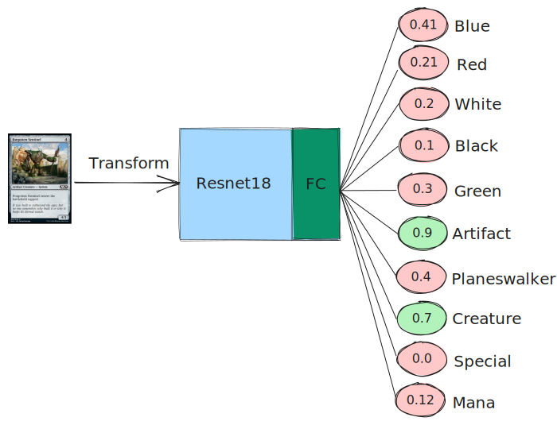
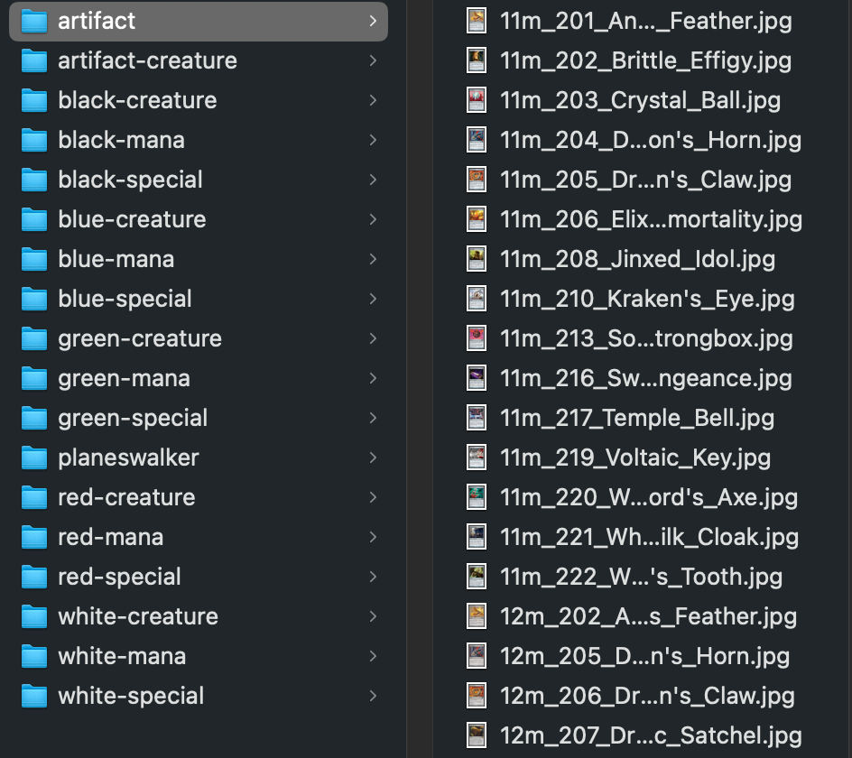
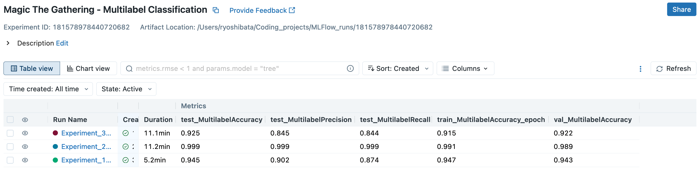
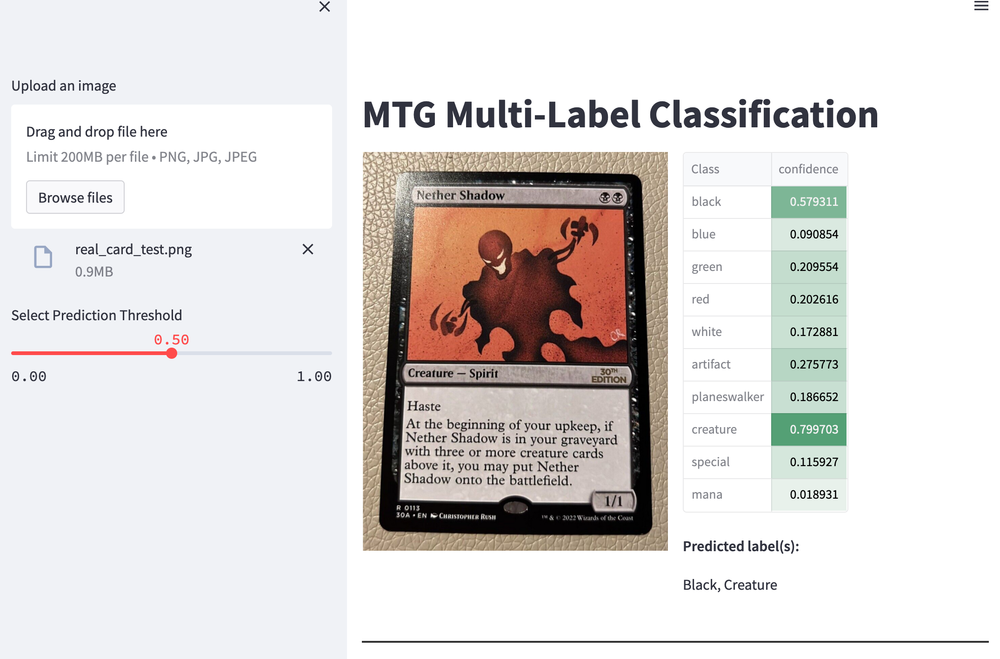

# Mutli-Label Image Classification with Pytorch Lightning

The purpose of this project is to learn and implement a multi-label image
classification model by using Lightning. The focus of this project will not be 
solely on the classifier itself but rather on the implementation process and
associated considerations.
Additionally, the project will involve integrating MLFlow to track and monitor 
the model training progress and metrics.
To visualize my inference of the model I will use jupyter notebooks and will 
create a streamlit app as well.

### <u>Why multi-label classfication?</u>
First and foremost I want to learn how to use several modules like lightning, 
MLFlow and streamlit. It was kind a random to choose this task but if offers a 
learning opportunity for myself.
Of course you can use an object detection model to detect several objects in an
image but sometimes it's faster for me to use torch's ImageFolder style labeling
instead of using CVAT (not considering the (semi-)automatic or iterative
labeling). So I adapted the torchvision ImageFolder class for multi-label
classification tasks.

### <u>What's the difference to multi-class classification?</u>
- Multi-class: Predicting one class per each image/data
- Multi-label: Predicting one or more class/label per each image/data

**_Visual concept of multilabel:_**  

### <u>Project Summary</u>
**Important: Content, both literal and graphical, is copyrighted by Wizards of
the Coast. This is a fan project with non-comercial usage!**

I made my own little "MNIST" example for multi-label classification by using
Magic the Gathering cards from mtgpics. I guess that there is no real life use
case for it but as I mentioned it is more for learning purposes. So the task will
be to predict the color of the card and whether it's a creature or a special
(spell/instant/enchantment) with one classifier.

To get the images I built a [webscraper](scripts/mtgpics_card_scraper.py) with
request and bs4. I scraped the images of several card-decks and sorted them into
different folders, like this:

It took about **~6.5 mins** to sort the images of a whole deck (~250-300 images) 
and to make a quick check afterwards. Take a look at the [data exploration notebook](notebooks/00_Image_Exploration.ipynb)
for more details about the data/images.

Followed by the data exploration I trained 3 different models in 
[this notebook](notebooks/01_Training_with_Lightning.ipynb) and tracked their 
results on a local MLFlow instance. In all experiment I used a Resnet18 as my
backbone and I used my Macbook GPU to train the model.

1. Experiment: pretrained backbone + frozen weights
2. Experiment: pretrained backbone
3. Experiment: untrained backbone + normalized on own train dataset

By looking at the test metrics (Accuracy, Precision, Recall) the 2nd experiment
leads to the best results. So I used the best checkpoint and performed some
[visual inference](notebooks/02_Model_Inference.ipynb) on the test dataset.
Furthermore I used streamlit to create a little prediction app, where you're 
able to pass any image to it and get a confidence score to each class (sigmoid prediction).

The model is able to make prediction on real cards as well but as expected it's
not so good as on mtgpic's images. This is one of the good examples ;)

# Information

Feel free to ask me if you have any questions to my projects or if you have 
suggestions for improvement. :)

### TODOs
- Upload the sorted data somewhere(Suggestions? Is it allowed to upload the data (copyrights?))
  - maybe create a shell script to download the data I used and sort them...
  - or upload the data to lfs?
- Finish documentation/docstrings
- Create a dockerfile for the streamlit app
- Use captum for explainable AI on some examples
- test streamlit app on another laptop/pc

# Setup Details
## <u>Hardware Specs</u>

MacBook Pro (16'', 2021)  
Apple M1 Max  
32 GB Memory  
Ventura 13.3.1 (a)

## <u>Tools</u>

Python Manager: Conda/pip  
Editor: PyCharm CE and VSCode  
Notes: Obsidian  
Terminal: zsh  
Package Manager: Homebrew

I will use poetry in the future but I had less problems with setting my
environment with conda on M1(MPS).
## <u>Main Tech:</u>
see requirements.txt  
Pytorch  
Lightning  
MLFlow  
Streamlit  
Jupyter Notebook  
